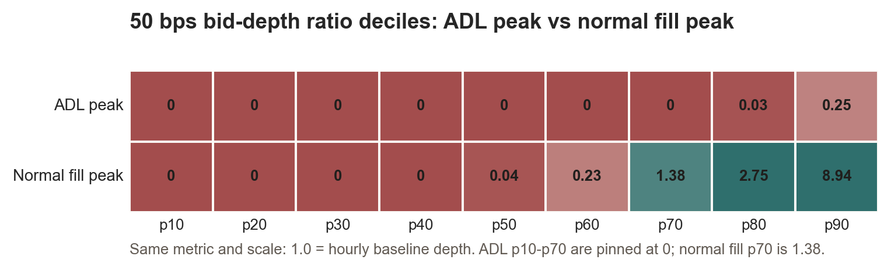

# Hyperliquid Liquidation Cascade and ADL Stress Study

This project is a compact public portfolio version of an independent research study on the October 2025 Hyperliquid liquidation and ADL stress event.

## Key Findings

**Bottom line.** Hyperliquid ADL behaved like forced risk transfer during a short liquidation cascade, not like a normal high-volume trading period.

- **Fill-level ADL/liquidation pairing was complete in the cleaned sample.** The study found 35,022 cleaned ADL rows, all matched to liquidation-side fills on the exact trade key.
- **ADL marked a much worse execution regime.** At exact ADL peaks, the median 50 bps bid-depth ratio was zero, while normal fill peaks recovered to 1.38x hourly baseline depth by p70.
- **Coin concentration alone was not the differentiator.** ADL top-five coin share was 76.6%, close to all-fill top-five share at 77.6%; the stronger result is the joint stress pattern across spread, depth, ADL/backstop liquidation, and coin composition.
- **Several protocol-mechanism questions remain out of scope.** The public evidence supports a reproducible stress-regime hypothesis, but does not prove ADL queue/ranking, bankruptcy-price logic, account-state transitions, or final loss-bearer accounting.

## Evidence Map

- `evidence/q1_event_inventory.csv`: cleaned ADL, liquidation fill, forced-liquidation metadata, and ledger liquidation event counts.
- `evidence/q1_adl_liquidation_match_rates.csv`: exact and tight-window ADL/liquidation match rates.
- `evidence/fixed_distance_bid_depth_ratio_deciles_summary.md`: spread and bid-depth ratio deciles around ADL and normal fill peaks.
- `evidence/unified_risk_theme_table.csv`: cross-study theme summary with evidence levels and limitations.
- `report/hyperliquid_adl_one_page.md`: concise research brief suitable for interview discussion.

## What is included

- A one-page research brief in `report/`.
- Two core notebooks in `notebooks/`.
- Small evidence tables in `evidence/` supporting the headline claims.
- Dataset configuration and field notes in `reproducibility/`.

## Data policy

Raw S3 downloads, cleaned parquet tables, and large local data artifacts are intentionally excluded. The copied evidence files are small derived outputs intended for auditability and interview discussion.

## Main caveat

This is a one-hour event study, not a universal model of Hyperliquid behavior. The analysis supports a reproducible stress-regime hypothesis, while leaving account-state, ADL queue/ranking, bankruptcy-price, and final loss-bearer questions out of scope unless additional data is collected.
